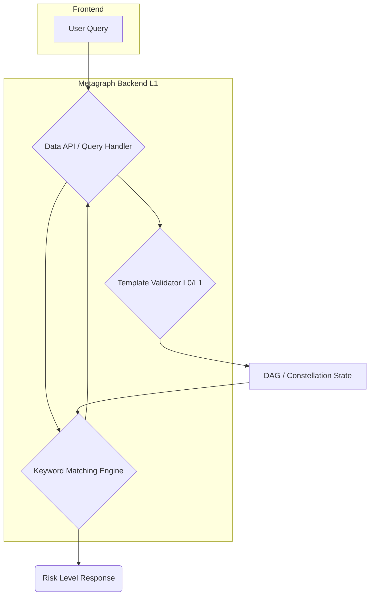

# 🧩 Euclid: Smart Insurance Metagraph


> Decentralized insurance policy verification and risk assessment powered by Constellation Network

[](https://opensource.org/licenses/MIT)
[](https://www.scala-lang.org/)
[](https://www.typescriptlang.org/)

## 📋 Overview

This application built on the Constellation Network revolutionises insurance policy management, it enables insurance providers to upload cryptographically signed policy templates while allowing end-users to query these policies using natural language for instant, trustless risk assessment.

**Example Query:** *"Does changing my exhaust void my insurance?"*  
**Response:** ⚠️ High Risk: Policy may be void if modifications are undeclared

## ✨ Key Features

| Feature | Description |
|---------|-------------|
| **🔐 Cryptographic Signing** | Every insurance template is cryptographically signed by providers, ensuring authenticity and non-repudiation |
| **✅ Trustless Validation** | Multi-layer validation across Layer 0 (signature, schema, hash) and Layer 1 (business rules, versioning) |
| **🧠 NLP-Powered Matching** | Advanced keyword extraction and semantic matching against policy clauses |
| **📊 Risk Scoring** | Automated risk assessment with clear Low/Medium/High classifications |
| **🔗 Decentralized State** | All data stored immutably on the Constellation DAG |
| **🎯 Schema Enforcement** | Strict JSON schema compliance ensures data consistency across providers |

## 🏗️ Architecture



### How It Works

1. **Template Upload**: Insurance providers submit cryptographically signed policy templates
2. **Layer 0 Validation**: Verifies signature authenticity, schema compliance, and hash integrity
3. **Layer 1 Processing**: Enforces business rules, provider linkage, and version tracking
4. **DAG Storage**: Validated templates are committed to the decentralized state
5. **User Query**: Natural language queries are processed through the NLP matching engine
6. **Risk Assessment**: Returns actionable risk levels based on policy clause analysis

## 🛠️ Technical Stack

| Category | Technology | Purpose |
|----------|-----------|---------|
| **Backend** | Scala | Robust, concurrent metagraph logic |
| **Frontend** | TypeScript, React | Modern, type-safe user interface |
| **Styling** | Tailwind CSS | Responsive, utility-first design |
| **Blockchain** | Constellation Metagraph SDK | Layer 0/Layer 1 validation and DAG state management |
| **Storage** | DAG State Storage | Immutable, decentralized data persistence |
| **Deployment** | Docker | Containerized environment for consistency |

## 🚀 Getting Started

### Prerequisites

- Scala Build Tool (sbt) 1.x
- Node.js 18+ and npm/yarn
- Docker (optional, for containerized deployment)
- Constellation Development Environment

### Installation

1. **Clone the repository**
   ```bash
   git clone https://github.com/your-username/euclid-metagraph.git
   cd euclid-metagraph
   ```

2. **Start the local metagraph node**
   ```bash
   sbt run
   ```

3. **Install frontend dependencies** (if applicable)
   ```bash
   cd frontend
   npm install
   npm run dev
   ```

### Testing the System

#### 1. Upload an Insurance Template

Create a signed template JSON file:

```json
{
  "UploadContractTemplate": {
    "providerName": "Acme Insurance",
    "templateVersion": "1.0",
    "terms": [
      {
        "category": "Vehicle Modifications",
        "clause": "Undeclared modifications void coverage",
        "severity": "high"
      },
      {
        "category": "Usage",
        "clause": "Commercial use requires additional coverage",
        "severity": "medium"
      }
    ],
    "rules": [
      {
        "condition": "modification_declared",
        "action": "coverage_maintained"
      }
    ]
  }
}
```

Submit the template:

```bash
curl -X POST http://localhost:9400/data \
  -H "Content-Type: application/json" \
  -d @template.json
```

#### 2. Verify Provider Registration

```bash
curl http://localhost:9200/insurance/providers
```

#### 3. Query Risk Assessment

```bash
curl http://localhost:9200/risk/does-changing-exhaust-void-insurance
```

### Example Output

Successful template ingestion:

```
📦 Building template...
🔐 Signing transaction...
Signing: {"UploadContractTemplate":{"providerName":"Acme Insurance",...
Hash: f38ef7c1a8ed102e...
📤 Sending to metagraph...
Endpoint: http://localhost:9400/data
✅ SUCCESS!
Hash: f38ef7c1a8ed102e0bbbf4153350920480e630e83649e114dd6326d1c487836a
Provider: Acme Insurance
Terms: 2, Rules: 2
```

## 🔌 API Reference

### Endpoints

| Method | Endpoint | Description |
|--------|----------|-------------|
| `POST` | `/data` | Ingest signed insurance templates or user queries |
| `GET` | `/insurance/providers` | List all verified insurance providers |
| `GET` | `/risk/:query` | Get risk assessment for a natural language query |

### Request Examples

**Upload Template:**
```bash
POST /data
Content-Type: application/json

{
  "UploadContractTemplate": { ... }
}
```

**Query Risk:**
```bash
GET /risk/does-tinting-windows-void-coverage
```

**Response:**
```json
{
  "query": "does tinting windows void coverage",
  "riskLevel": "medium",
  "matchedClauses": [
    {
      "category": "Vehicle Modifications",
      "severity": "medium",
      "clause": "Window tinting must comply with local regulations"
    }
  ]
}
```

## 🐛 Troubleshooting

| Issue | Solution |
|-------|----------|
| Provider list returns "not found" | Verify `data_l1` service is running and ports 9200/9400 are exposed |
| Template ingestion fails | Check JSON schema compliance and signature validity |
| Connection refused | Ensure local metagraph node is running on correct ports |

## 🗺️ Roadmap

- [ ] Decouple `/insurance/providers` endpoint from main NFT project dependency
- [ ] Complete user prompt ingestion implementation via `/data`
- [ ] Enhance and fine-tune NLP keyword matching engine
- [ ] Implement frontend risk visualization dashboard
- [ ] Finalize Layer 0/Layer 1 lifecycle integrity checks
- [ ] Deploy to Constellation IntegrationNet (Testnet)
- [ ] Production deployment on Constellation MainNet

## 🤝 Contributing

We welcome contributions from the community! Here's how you can help:

1. **Fork** the repository
2. **Create** a feature branch (`git checkout -b feature/amazing-feature`)
3. **Commit** your changes (`git commit -m 'Add amazing feature'`)
4. **Push** to the branch (`git push origin feature/amazing-feature`)
5. **Open** a Pull Request

Please ensure your code follows our coding standards and includes appropriate tests.

### Development Guidelines

- Write clear, descriptive commit messages
- Add tests for new features
- Update documentation as needed
- Follow Scala and TypeScript best practices

## 📄 License

This project is licensed under the MIT License - see the [LICENSE](LICENSE) file for details.

## 🙏 Acknowledgments

- Built on [Constellation Network](https://constellationnetwork.io/)
- Powered by the Constellation Metagraph SDK
- Inspired by the need for transparent, decentralized insurance verification

## 📞 Contact & Support

- **Issues**: [GitHub Issues](https://github.com/your-username/euclid-metagraph/issues)
- **Discussions**: [GitHub Discussions](https://github.com/your-username/euclid-metagraph/discussions)
- **Documentation**: [Wiki](https://github.com/your-username/euclid-metagraph/wiki)

---

<div align="center">
  <strong>Building the future of decentralized insurance 🚀</strong>
</div>
